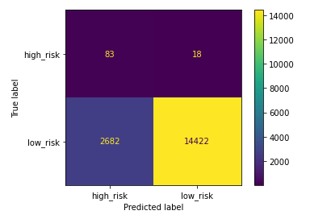

# Credit_Risk_Analysis

Using Scikit-learn and imbalanced learn to conduct a credit risk analysis on sample credit data provided to us.

## Overview

The purpose of this analysis was to use various machine learning models in order to evaluate the credit risk of individual customers. The dataset used is from LendingClub which is advertised as "a peer-to-peer lending service company". The dataset is cleaned and then each model performs its analysis. The results are shown below. 

## Algorithms

- RandomOverSampler
- SMOTE
- ClusterCentroids
- SMOTEENN
- BalancedRandomForestClassifier
- EasyEnsembleClassifier

## Results

- RandomOverSampler

A confusion matrix has been generated

