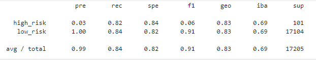
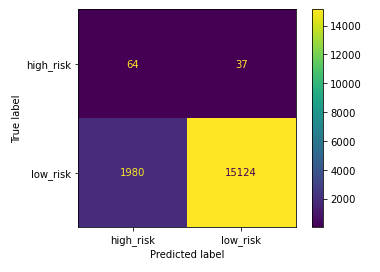

# Credit_Risk_Analysis

Using Scikit-learn and imbalanced learn to conduct a credit risk analysis on sample credit data provided to us.

## Overview

The purpose of this analysis was to use various machine learning models in order to evaluate the credit risk of individual customers. The dataset used is from LendingClub which is advertised as "a peer-to-peer lending service company". The dataset is cleaned and then each model performs its analysis. The results are shown below. 

## Algorithms

- RandomOverSampler
- SMOTE
- ClusterCentroids
- SMOTEENN
- BalancedRandomForestClassifier
- EasyEnsembleClassifier

## Results

- **RandomOverSampler**

A confusion matrix has been generated

An imbalanced classification report has been generated

A balanced accuracy score has been generated

*The precision score (.99) and recall score (.91) were decent. The balanced accuracy score (.832) was lower than many models. These scores don't make for a realiable model*

- **SMOTE**

A confusion matrix has been generated

An imbalanced classification report has been generated

A balanced accuracy score has been generated

*The precision score (.99) and recall score (.92) were decent. The balanced accuracy score (.844) was better than other models. These scores don't make for a realiable model*

- **ClusterCentroids**

A confusion matrix has been generated

An imbalanced classification report has been generated

A balanced accuracy score has been generated

*The precision score (.99) and recall score (.92) were decent. The balanced accuracy score (.844) was the same or better than other models.These scores don't make for a realiable model*

- **SMOTEENN**

A confusion matrix has been generated

An imbalanced classification report has been generated

A balanced accuracy score has been generated

*The precision score (.99) and recall score (.92) were decent. The balanced accuracy score (.838) was the same or better than other models. These scores don't make for a realiable model*

- **BalancedRandomForestClassifier**

A confusion matrix has been generated

An imbalanced classification report has been generated

A balanced accuracy score has been generated

*The precision score (.99) and recall score (.93) were decent. The balanced accuracy score (.759) was worse than all the other models. These scores don't make for a realiable model*

- **EasyEnsembleClassifier**

A confusion matrix has been generated

An imbalanced classification report has been generated

A balanced accuracy score has been generated

*The precision score (.99) and recall score (.97) were better than all the other models. The balanced accuracy score (.931) was also better than all the other models, but these scores don't make for a realiable model*

## Summary

The machine learning models used for this dataset did not have the desired outcome as all the scores were less than what was needed to produce an acceptable and reliable model. I would not use any of these models as they can not accurately predict who the high risk clients would be.

